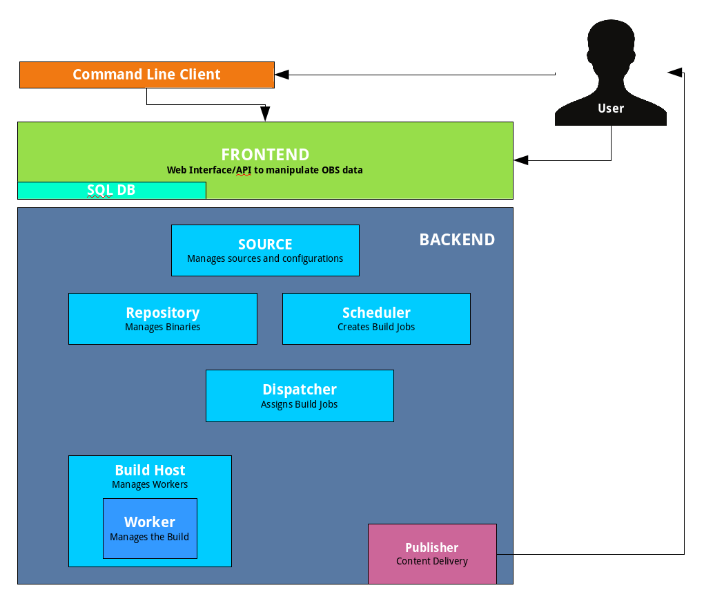
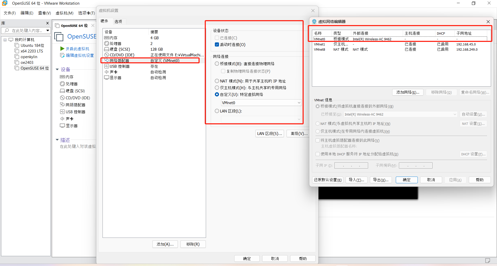

# deploy OBS
## OBS introduction
### OBS high-level overview

#### front end
OBS 前端是一个使用 Ruby on Rails 构建的应用程序，它管理对 OBS 数据的访问和操作。它提供了一个 Web 用户界面和一个应用程序编程接口（API），用于创建、读取、更新和删除用户、项目、包、请求以及其他对象。它还实现了身份验证、搜索和电子邮件通知等附加子系统。

#### back end
OBS 后端是一组用 Perl 编写的应用程序，用于管理源文件和构建作业。
- source server：维护源代码仓库和项目/包配置。**它提供了一个 HTTP 接口，这是前端唯一的接口**。它可能将请求转发给其他后端服务。每个 OBS 安装都有一个源服务器。它维护 "sources"、"trees" 和 "projects" 目录。
- Repository Server：HTTP 接口提供二进制文件的访问。它仅通过source server被前端使用。工人使用该服务器注册、请求构建作业所需的二进制文件，并存储结果。仓库服务器还创建调度器的通知。每个 OBS 安装至少有一个仓库服务器。使用分区的大型安装在每个分区上都有一个。
- Scheduler：调度器计算构建作业的需求。它检测源代码、项目配置或构建环境中使用的二进制文件的变更。它负责按正确顺序启动作业并集成构建的二进制包。每个 OBS 安装每个可用的架构和分区都有一个调度器。它维护 "build" 目录。
- Dispatcher：分发器获取调度器创建的作业，并将其分配给空闲的工人。它还检查可能的构建约束，以验证工人是否符合作业要求。分发器只通知工人作业情况；工人本身下载所需资源。每个 OBS 安装每个分区都有一个分发器（其中一个是主分发器）。
- Publisher：发布者处理来自调度器的 "发布" 事件，用于完成的仓库。它合并所有架构的构建结果到一个定义好的目录结构中，创建所需的元数据，并可选地将其同步到下载服务器。它维护后端的 "repos" 目录。每个 OBS 安装每个分区都有一个发布者。
- Source Publisher：源发布者处理来自发布者的 "sourcepublish" 事件，用于发布的二进制仓库。它需要与源服务器在同一实例上运行。它可用于发布一个文件系统结构，提供所有已发布二进制的源代码。对于镜像或容器，这也包括使用的二进制包的源代码。
- Worker：工人向仓库服务器注册。他们从分发器接收构建作业。之后，他们从源服务器下载源代码，以及从仓库服务器（们）下载所需的二进制文件。他们使用构建脚本构建包，并将结果发回仓库服务器。工人可以与其他服务在同一主机上运行，但大多数 OBS 安装为工人使用专用硬件。
- Signer：签名者处理签名事件，并调用外部工具执行签名。每个 OBS 安装通常每个分区有一个签名者，在源服务器安装上也有一个。
- Warden：看守者监控工人，检测崩溃或挂起的工人。他们的构建作业将被取消，并在另一台主机上重新启动。每个 OBS 安装可以在每个分区上运行一个看守者服务。
- Download on Demand Updater：按需下载更新器监控所有被定义为 "按需下载" 资源的外部仓库。它轮询元数据中的变更，并在需要时重新下载元数据。调度器将被通知重新计算依赖这些仓库的构建作业。每个 OBS 安装可以在每个分区上运行一个 dodup 服务。
- Delta Store：Delta存储守护进程维护源存储中的增量。可以在一个deltastore中存储多个obscpio归档，以避免磁盘上的重复。该服务计算增量并维护delta存储。每个 OBS 安装可以在源服务器旁边运行一个 delta 存储进程。

### OBS和openSUSE关系非常紧密
openSUSE的官方文档中直接依赖了其包管理器zypper的pattern特性以下载OBS，这种特性在dnf/yum上是不支持的。

## OBS deployment
### 1 oE尝试部署OBS
#### 1.1 httpd的拉起失败
OBS需要一个http前端帮助用户使用OBS，其实现依赖于httpd.service的启动，但是OBS的配置文件无法直接在oE上启动，主要有以下问题

**1.缺少模块**

缺少mod可能有两个原因：
  - mod未安装：大部分mod以mod_@module-name的形式提供，可以通过yum安装。可以在/etc/httpd/modules目录下查看当前安装的所有apache server modules
  - mod安装了，但是未加载（load）:httpd/Apache Server有两类config文件
    - Apache server的conf文件在/etc/httpd/conf.d/目录下
    - 指定Apache server需要加载的module的conf文件在/etc/httpd/conf.modules.d目录下，通过
    ```
    LoadModule @module_name @module_path
    ```
    命令实现module的加载，并且可以通过
    ```
    apachectl -M | grep @module_name
    ```
    查看module加载是否成功
    
比如
  - 未安装mod_ssl导致无法使用SSLengine命令，该mod安装之后会自动load
  - mod_xforward已安装，但是mod没有自动load，需要手动添加mod conf文件是实现load mod

**2.httpd无法监听指定端口**

主要原因是缺少SELinux permissions.SELinux默认只允许apache server/httpd绑定到几个可选的port：
```
80, 81, 443, 488, 8008, 8009, 8443, 9000
```
而OBS服务需要httpd监听82端口，没有SELinux权限，需要通过以下命令添加权限
```
@-t http_port_t:指定对httpd服务添加权限
@-p tcp:使用TCP协议
@listend_port:httpd服务监听的端口
semanage port -m -t http_port_t -p tcp @listend_port
```

#### 1.2 结论：oE对OBS的支持不足
- openEuler 22.03有相关文档支持在2203上部署OBS server，但是使用的是单独的源，包含了OBS相关和依赖的ruby相关的软件包，OBS版本是2.10.11。
- 根据测试结果，oE 2403中everything中提供了OBS相关包，但是属于废弃包，无法提供完整的OBS运行所需软件，实际oE的构建环境仍然是在openSUSE上部署的，**openEuler暂时不支持部署OBS**

### 2. openSUSE部署OBS
[openSUSE官方文档](https://openbuildservice.org/download/)提供了多种手段用于部署本地的OBS实例，包括：
- 1.包含所有OBS组件并完成初始化的OBS x64镜像
- 2.包含所有OBS组件并完成初始化的VMware虚拟磁盘
- 3.在openSUSE发行版上使用zypper拉取OBS_server模板完成OBS组件安装，并使用OBS提供的自动化脚本完成初始化

本章节以方式3为例说明
#### 2.1 在VMware/物理机器上部署openSUSE
国内源（如中科大源）提供了openSUSE镜像下载，参考openSUSE官方提供的vmdk文件使用的openSUSE 15.5发行版，选择openSUSE 15.5的镜像下载。
- openSUSE对网络配置要求比较严格，在VMware上配置时，首先需要配置一个桥接模式的虚拟网络，外部连接到物理网卡上，并且在vmware中配置网络适配器连接到该虚拟网络中。

同时，在安装虚拟机时，需要指定网卡配置通过DHCP动态获取IP地址。
- 而且，不管在物理环境还是VMware上**因为OBS需要配置DNS中的hostname供osc使用，所以建议在配置网络时同时配置DNS hostname，并且确保其可用性**。
#### 2.2 在openSUSE上拉取OBS依赖
根据openSUSE官方教程，执行以下指令添加OBS_server软件源，并且通过zypper拉取OBS_server模板，该步骤会同步拉取所有依赖。
```
zypper ar -f https://download.opensuse.org/ \
repositories/OBS:/Server:/2.10 \
/15.5/OBS:Server:2.10.repo

zypper in -t pattern OBS_Server
```
**注意**：**不要替换国内源!**，国内源落后于openSUSE官方源，在拉取依赖时会找不到符合要求的软件包版本而无法正常工作。在openSUSE 15.5和15.6上可能都存在该问题。
#### 2.3 拉起OBS服务并进行初始化（simple installation）
OBS提供了初始化的脚本，运行脚本进行初始化（此时所有front/backend的组件全部部署在同一环境中）
```
/usr/lib/obs/server/setup-appliance.sh --force
```
openSUSE官方的推荐配置（VMware环境下，simple installation）为
- 4 GB memory
- 1 virtual hard disk of 20 G for / and /var/cache/obs
- 1 virtual hard disk of 50 G for /srv/obs
- a virtual CD-ROM driver pointing to the downloaded ISO image
- network bridging with real Ethernet card