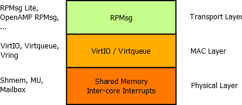
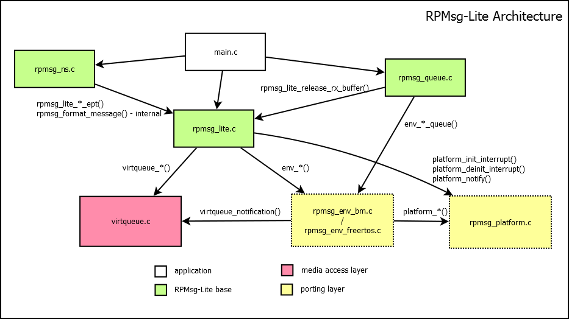
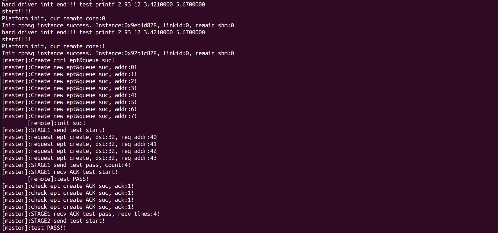

# 项目信息
- **项目名称**：移植部署 MCS on MilkV Duo RISCV大小核
- **方案描述**：本项目需要在MilkV Duo多核异构开发板上完成openEuler MCS项目的（**以下简称MICA项目**）移植，在MilkV Duo上实现openEuler 24.03 + Uniproton + baremetal的混合关键操作系统部署方案。
- **时间规划**：
    1. **阶段一**：对MICA项目和yocto-meta-openeuler项目进行调研（**一周**）
    2. **阶段二**：移植Uniproton到C906l（MilkV Duo小核），并在MilkV Duo SDK中实现和测试Linux与Uniproton间的通信机制（**三周**）
    3. **阶段三**：在MilkV Duo SDK上支持MICA，并适配Uniproton侧资源表和Linux侧mica driver（**三周**）
    4. **阶段四**：移植RPMsg-lite到Uniproton on RISC-V准备用于C906l与8051的通信（**两周**）
    5. **阶段五**：添加MilkV Duo SDK到yocto-meta-openeuler中，通过oebuild(yocto)构建使用openEuler 24.03的MilkV Duo SDK（**三周**）

# 项目总结
## 项目进展
1. 完成对MICA项目的调研分析，并产出MICA和RPMsg协议栈的分析文档到开源社区
    - [RPMsg协议栈分析文档](https://github.com/openeuler-riscv/oerv-rtos/tree/main/doc/uniproton/rpmsglite/RPMsg_Protocol)。
    - [MICA架构分析文档](https://github.com/Mechanicu/Cinos/blob/develop/mica/mica_arch.md)
2. 基本实现基于MICA项目在MilkV Duo上实现openEuler 24.03 + Uniproton的混合关键系统部署和demo测试。
3. 基本完成RPMsg-lite在Uniproton on RISC-V上的移植和测试
## 项目关键技术总结
### MCS(混合关键系统)
MCS是一种主要面向嵌入式环境的OS/runtime的部署方案。它的目标是充分利用不同OS/runtime的特性，如Linux丰富的生态，RTOS的高可靠性和实时性，裸核的高性能等。

目前主要有两种MCS方案
- **基于openAMP项目**: [OpenAMP项目](https://www.openampproject.org/)定义了一套标准的用于在MCS环境下进行OS/runtime间通信的协议栈——RPMsg，以及一个参考实现。OpenAMP项目下OS/runtime间以一种类似分布式系统的方式协作，并通过共享物理内存和核间中断进行通信。
- **基于RTOS hypervisor**：在这种方案中，通常RTOS作为host+hypervisor，Linux作为guest虚拟机，复杂的服务由guest提供，需要高实时性和可靠性的任务则运行在host上，Linux和RTOS通过虚拟设备前后端进行通信。
### RPMsg协议栈和RPMsg-lite
#### RPMsg协议栈
RPMsg是openAMP项目定义的用于实现OS/runtime间通信的协议栈。如下图，其协议栈可以分为三个层次：

- **传输层**：该层是为了实现端到端的IPC通信。MAC层提供的功能类似简单message queue，在并发通信的情况下不利于管理，该层定义了通信主体——endpoint，通过将message与endpoint关联实现了有序收发消息。
- **MAC层**：该层目的是提高shmem的利用率。因为RPMsg主要面向Linux+RTOS/baremetal的部署方式，为了充分利用Linux内核，该层使用virtqueue结构管理shmem。
- **物理层**：定义了核间通信的方式：基于shared physical mem实现数据交换 + IPI实现通知机制
#### RPMsg-lite
RPMsg-lite是NXP对RPMsg协议栈的一种轻量级实现。它与openAMP主要面向Linux不同，RPMsg-lite主要面向inter RTOS/baremetal通信
### MICA
MICA是openEuler的MCS项目，它基于openAMP项目但是进行了一定的改进。MICA系统中一般以Linux为host OS，RTOS为guest OS（MICA的通信逻辑中仅处理Linux主动向RTOS发起通信）。

从操作系统的角度来看，MICA主要分为两个部分：
- Linux端：Linux端包括用户态的micad/mica（micad是mica守护进程，与mica driver交互，mica是命令行工具，用于向micad发送请求，因为mica作为client仅负责向micad发送请求，在移植时不需要关注，暂时忽略它）和内核态的mica driver。
    - **micad**：该组件与架构无关，它主要提供两个功能：
        1. 数据交换：为了避免在内核中执行耗时的数据拷贝操作，MICA在用户态的micad中完成了数据拷贝到共享物理内存中的操作。
        2. 用户访问mica driver的中间层：micad通过POSIX标准文件操作接口访问mica driver。所有用户操作都需要通过micad封装的函数传递给mica driver，如RTOS生命周期管理等。
    - **mica driver**：该组件是MICA的核心组件，与架构相关，因为涉及Linux和RTOS的交互代码，目前仅在x86和ARM架构上实现。mica driver需要对POSIX标准文件操作进行实现供micad使用，并且处理micad传递的用户命令，包括RTOS生命周期管理相关命令，和通知RTOS接收消息（消息拷贝在micad中完成，见前文）等。
- RTOS端：
    - **RPMsg backend**：RTOS端需要实现RPMsg的backend用来与Linux通信。具体如何处理RPMsg backend接收到的消息由RTOS应用自行决定（Uniproton目前不支持动态加载应用，使用何种应用在构建时即确定）
    - **资源表**：RTOS侧所需要的资源信息需要使用对应的资源表项进行承载，并整合存放到资源表中。Linux 在加载RTOS ELF镜像时，会先找到.resource_table段，再根据其中存放的表项执行对应的初始化动作。

按照MICA的逻辑，小核最开始不会运行RTOS。当用户需要在小核上部署RTOS时，需要通过micad向预先规定好的供小核使用的物理内存中加载RTOS的镜像，然后通知小核运行该镜像拉起RTOS，才能进一步通过RTOS控制小核资源（这一点与MilkV Duo SDK的逻辑不一致，后文会详细说明）。
### 构建openEuler embedded发行版
一个Linux发行版基本可以理解为Linux kernel + rootfs（包含所需软件包）的一个集合。面向服务器/PC的openEuler和openEuler embedded的构建方式不同。server openEuler的构建基于OBS（Open Build service）构建发行版和所需软件包。而openEuler embedded的构建使用主要面向嵌入式Linux构建的yocto项目。

为了更加易于维护openEuler embedded对不同硬件环境的支持，openEuler embedded提供了：
- 一个供yocto使用的yocto配方层yocto-meta-openeuler
- 一个对yocto的高级封装，自动化的openEuler embedded构建工具oebuild

新增一个yocto BSP配方层非常复杂，目前在MilkV Duo SDK中启用openEuler 24.03的方式是手动bootstrap一个对应发行版的rootfs出来，并打包到MilkV Duo SDK的镜像中。稍后会详细说明使用oebuild和yocto-meta-openeuler构建MilkV Duo SDK过程中遇到的问题和难以推进的原因。
## 项目经验分享
### 添加Uniproton支持到MilkV Duo SDK
MilkV Duo SDK中有一套现成的MCS部署方案：Linux + FreeRTOS基于共享内存的消息队列进行通信。同时，因为Uniproton完全面向MICA项目，这个特性极大的影响其支持MilkV Duo SDK的流程。
- **精简的设备驱动**：因为主要作为MICA项目中Linux访问小核物理资源的一个固件，Uniproton通常不会被单独部署，其对设备的依赖和控制度相当低，基本仅涉及读写串口和中断寄存器。
- **简化的构建流程**：同样因为其作为MICA项目固件的特性，Uniproton标准的构建流程最终构建出的是一个bin文件，可以直接被Linux加载到内存中并通知小核运行该bin文件。

为了添加Uniproton支持到MilkV Duo SDK中，主要涉及以下两个方面的工作。
#### 移植Uniproton到C906l
为了Uniproton能够正常在MilkV Duo的小核上运行，首先需要适配Uniproton到小核。一般来说适配涉及两个层次：
1. 第一个层次是arch适配，即适配OS到当前指令集。
2. 第二个层次是board适配，即适配OS对板载设备，主要是添加驱动。

罗君老师已经完成了Uniproton在RISC-V上的移植，并在QEMU RISC-V上完成了测试，arch适配已经完成，仅需要完成Uniproton对板载设备的适配。

如前文所说，Uniproton运行仅需要用于交互的串口设备和中断寄存器。这两种设备对驱动的要求相当简单。因此适配Uniproton到C906l只需要适配串口和中断寄存器的地址即可。

#### 修改Uniproton的构建和打包流程
相比适配Uniproton到C906l，修改Uniproton的构建流程使其可以正常打包到MilkV Duo SDK中并被拉起更加复杂。Uniproton标准构建流程会生成bin文件直接被加载。但是MilkV Duo SDK的构建基于Buildroot，并进行了非常繁琐的二次封装，其拉起RTOS的方式也与MICA不同。在MilkV Duo上，大小核互不感知，其启动流程大致如下：
1. 首先启动fsbl（frist bootloader，一阶段bootloader），fsbl会加载并通知小核运行FreeRTOS，然后在大核上运行U-Boot准备加载Linux镜像。
2. U-Boot在大核上运行，加载Linux镜像并引导大核运行Linux，此时小核已经在运行FreeRTOS了。
3. Linux在大核上运行，FreeRTOS在小核上运行，两者通过预先规定的共享物理内存进行通信实现Linux对小核的控制

可以发现其和MICA启动RTOS的逻辑完全不同，MICA中RTOS由Linux加载镜像并直接通知小核运行，而MilkV Duo SDK中则是由fsbl加载并引导小核运行，两者对RTOS的构建方式也会因此产生差别。

为了便于对接MilkV Duo SDK，参考FreeRTOS的构建方式，在MilkV Duo SDK的仓库下添加了Uniproton的目录，并修改了RTOS构建脚本，将其对接到Uniproton，确保fsbl可以正确识别和加载Uniproton。

完成以上两步之后，Uniproton已经可以正常打包到SDK中，并被fsbl拉起了。但是此时并没有实现MCS部署，因为Uniproton和Linux还无法进行通信和协作(下面是Uniproton移植成功测试)
<video controls src="./doc_video/uniproton_adapt_test.mp4" title="Title"></video>

### 在MilkV Duo SDK支持MICA
前文已经说明从OS角度看MICA包括两个部分：Linux部分和RTOS部分。本节主要从这两个方面分享我们的移植经验。
#### Linux侧：micad和mica driver适配
MICA在Linux侧包括用户态的micad和内核态的mica driver。micad本身与架构无关，它仅通过标准文件操作接口访问mica driver以获取服务。因此只要这些文件操作接口被mica driver实现了，micad就可以正常工作，而根据MICA spec，micad依赖以下文件操作：
- open/close：基础接口，进程需要关联一个fd到mica driver才能进行交互。
- mmap：用于将用于加载RTOS镜像的物理内存映射到用户空间，在用户态下将RTOS镜像加载到该段内存中以避免在内核中耗费大量时间拷贝数据（RTOS一般在构建时将整个bin文件塞到micad中）。
- ioctl：micad通过ioctl完成通知RTOS接收消息和管理RTOS生命周期，包括start/stop RTOS，以及send_ipi（严格来说start/stop也是在send_ipi，这里该接口专用于通知RTOS接收消息）。

因此关键在于mica driver，因为需要与RTOS进行通信，涉及中断和共享物理内存的适配，需要根据board进行适配。参考x86/ARM架构mica driver的做法，共享内存信息，中断处理号等都是在构建时静态配置好的。
#### RTOS侧：配置资源表和RPMsg backend
Linux侧和RTOS侧需要在构建时即确定双方对接的中断号和共享内存信息。RTOS已经由RPMsg backend的代码实现，需要完成RPMsg协议栈中platform层与Linux和MilkV Duo的对接。

这个部分完成之后，MilkV Duo SDK已经支持Linux + Uniproton基于MICA项目的MCS部署了，测试适配如下。
<video controls src="./doc_video/uniproton_mcs_deploy.mp4" title="Title"></video>
### 在Uniproton on RISC-V上移植RPMsg-lite
RPMsg-lite是RPMsg的一个轻量级实现。之所以考虑移植RPMsg-lite到Uniproton上。主要考虑到以下因素：
- **MilkV Duo异构多核现状**：MilkV Duo除了一个RISC-V大核，一个RISC-V小核外，还有一个8051核。8051核不足以支持运行负载的runtime，因此需要一种可靠易用的通信组件帮助Linux/RTOS调用8051硬件资源。
- **支持Uniproton实现更丰富的异构多核部署**：除了在MilkV Duo上部署之外，为了让Uniproton在更多硬件环境中支持**RTOS+RTOS/RTOS+baremetal**的轻量异构部署方案，同样需要一种可靠易用，并且有相对丰富的生态，易于在不同OS/runtime间对接的通信协议，而RPMsg-lite正好满足这些要求。

RPMsg-lite官方提供了标准的组件移植流程，如下图，整个RPMsg-lite的代码分为几个层次：
- **架构相关代码**：
    - platform layer：RPMsg协议栈中物理层是直接对接硬件的，RPMsg-lite将这部分封装在platform.c文件中，每个架构需要按照RPMsg-lite spec实现自己的platform.c文件。
    - environment layer：这一层没有直接对应RPMsg协议栈。它的目标是对接由OS/runtime提供的功能，如内存和任务管理等。
- **架构无关代码**：RPMsg协议栈中的MAC层和传输层以为RPMsg-lite对env/platform层的封装后与架构和环境无关，可以直接运行。

详细的[RPMsg-lite在Uniproton on RISC-V移植文档参考该链接](https://github.com/openeuler-riscv/oerv-rtos/blob/main/doc/uniproton/rpmsglite/RPMsg-lite_Port/Porting_RPMsg-lite_on_Uniproton_on_QEMU_RISC-V.md)，目前完成了RPMsg-lite在Uniproton上的移植，并在QEMU RISC-V环境上进行了基本的测试，测试结果如下图。

## 失败分析：在openEuler yocto上支持MilkV Duo SDK的构建为何失败
### MilkV Duo SDK构建方式过于复杂和独立
最初项目需求中希望在完成MICA在MilkV Duo SDK上的支持的同时，实现在openEuler yocto上支持MilkV Duo SDK的构建。因为MilkV Duo SDK目前采用基础组件分别构建 + Buildroot构建发行版并打包的方式，整个构建逻辑对非开发者来说非常复杂，难以理清和拆分构建流程。

同时MilkV Duo SDK的Linux/U-Boot很可能和openEuler embedded Linux/U-Boot基线不同。以同样是RISC-V架构的环境对比，QEMU RISC-V可以直接复用poky的配方层，仅需替换rootfs中的软件包为yocto-meta-openeuler即可；而另外一种VisionFive仅提供了dts，kconfig和kernel.patch文件，仅需要简单的应用patch和配置即可直接构建openEuler embedded，而MilkV Duo与他们相比复杂度更高，不太能参考已有配置。

根据目前的分析，我们对Buildroot，yocto和MilkV Duo SDK本身都不够熟悉，难以支撑SDK从Buildroot转yocto以及后续维护的工作。
### 时间相对较为紧张
整个MICA项目和MilkV Duo SDK对我们来说是全新的领域，我们在熟悉MICA项目架构及其工作原理，并尝试将其移植到MilkV Duo SDK上时花费了不少时间，工作量并不算小。我们没有足够的时间去继续熟悉yocto和openEuler yocto项目，openEuler社区目前相关的技术分析主要关注基于yocto-meta-openeuler在openEuler embedded中添加软件包，缺少添加BSP层的相关文档。
# 项目产出
按照预期，整个项目产出应该与至少三个仓库相关：
- **yocto-meta-openeuler**：如果成功在openEuler yocto项目中支持MilkV Duo SDK的构建，在该仓库中应该合入新增的MilkV Duo的BSP配方层，并且可能通过动态拉取yocto-meta层的方式管理MilkV Duo SDK中独有的kernel modules和rootfs中的其它配置文件等。
- **Uniproton**；我们适配了Uniproton到MilkV Duo的小核，并添加了资源表相关的板基支持，同时，我们还适配了RPMsg-lite到Uniproton中，这些应当合入Uniproton的仓库中。
- **mica**：成功适配MICA项目到MilkV Duo SDK，使其可以通过MICA项目在MilkV Duo上实现openEuler embedded + Uniproton的MCS部署。对mica driver在RISC-V和MilkV Duo上的适配应当合入。

**但是根据社区反馈，因为我们没有完成MilkV Duo SDK通过yocto进行构建的任务，MICA项目相关的PR社区不希望合入**。而RPMsg-lite因为和MICA相对独立，因此准予合入，所以最终我们只能合入RPMsg-lite的PR到Uniproton的仓库。