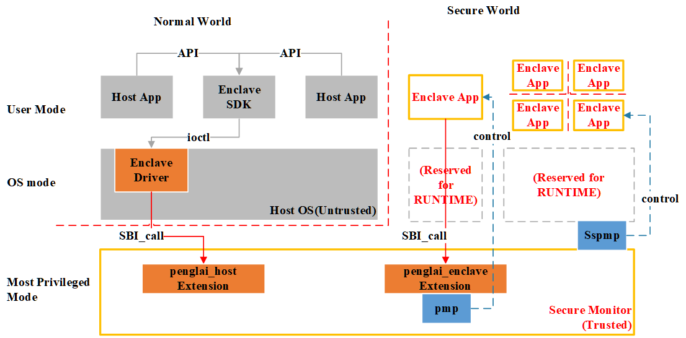
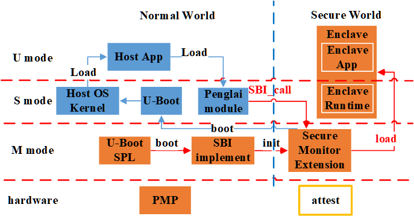
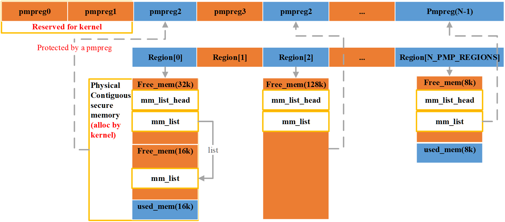
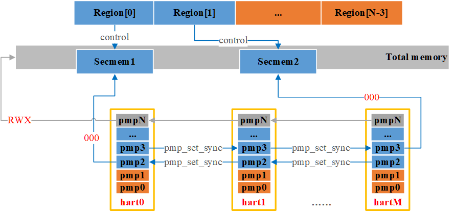
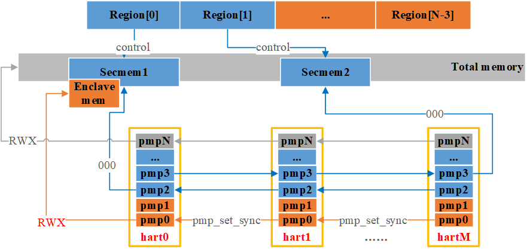
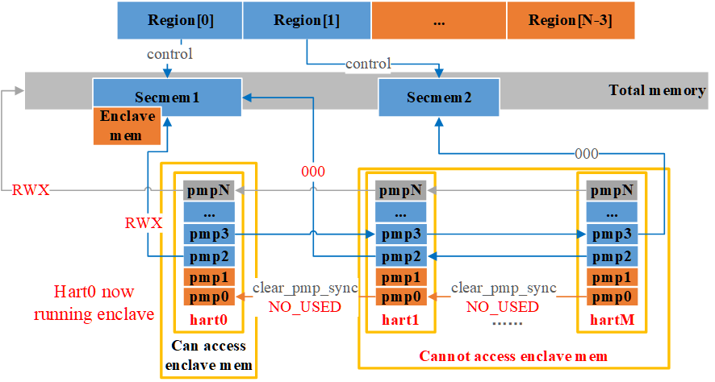
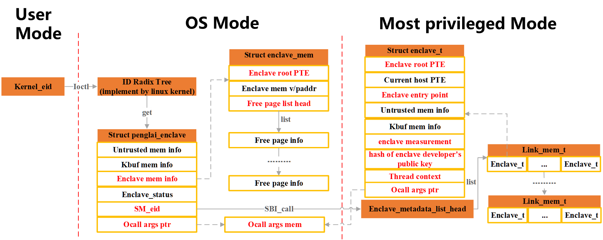

# Penglai Enclave Secure Monitor
[penglai-enclave-pmp仓库](https://github.com/Penglai-Enclave/Penglai-Enclave-sPMP.git)

[penglai运行指导文档](https://github.com/Mechanicu/Cinos/blob/develop/penglai/penglai_HowToRun.md)
## TEE术语解释（来自Confidential Computing Consortium）
- **Trusted Execution Environment(可信执行环境)**：An environment ensuring data & code integrity, blocking unauthorized access during use.
- **Enclaves(一般翻译为内存飞地)**：An enclave is a secure, isolated memory part in a TEE for securely processing sensitive data and code.
- **Attestation(验证)**：Verifies TEE's software & hardware integrity via signed proof before handling sensitive data.
- **Trust Computing Base(可信计算基础)**：TCB定义了一个系统内部的最小范围，这个范围内的组件需要被信任以确保系统的安全性和完整性，后面会介绍Penglai如何使用TCB确保安全。
- **Root of Trust(可信根)**：RoT是一个安全系统必须信任的最小组件集合，作为信任的起点。这些组件包括硬件、固件、软件或这些的组合，它们是构建信任链的基础，确保系统的安全性和完整性。
## Penglai Enclave架构

## Penglai的可信基
TEE中, 可信基(Trusted Computing Base)指被信任不会主动尝试窃取或泄露机密数据的组件, 并且**为了确保TCB不会被未授权软件攻破，TEE会尽可能减小TCB的攻击面**
- `硬件可信基`: Keystone和Penglai Enclave目前基本依赖`PMP`实现TEE最关键的内存隔离。同时RISC-V的其他spec也可能用于TEE，如`Sspmp`(S-Mode PMP)，`Smepmp`，`AP-TEE`，以及用于外设安全的`IOPMP`等。同时，**因为RISC-V目前缺少attest相关的硬件支持，所以RISC-V对可信启动？**
- `软件可信基`: `Secure Monitor`是Penglai最关键的软件TCB，目前**Penglai的SM实际上是两个`SBI extension`，一个用于Host OS控制Enclave的生命周期，一个用于Enclave向Host请求服务。**
## Penglai Secure Monitor介绍

### RISC-V可信启动流程
Penglai基于可信链确保任何非授权软件无法获取可信链上任一节点在内存中的数据，penglai可信链的建立流程大致如下图所示，**其中`橙色组件在可信链上`，需要可信引导/启动，`蓝色是不可信组件`.**

### 基于PMP的安全内存实现
**`Secure Monitor`主要职能是管理安全内存**，管理结构大致如下图。

#### 内存管理
安全内存以`region`为单位进行管理，每个`region`对应独有的`PMP reg`，所有的`region`以数组的形式管理。需要`拓展安全内存`时，需要在Host OS中申请足够的连续物理内存，并使用该内存初始化一个未使用的region。

SM目前**使用`buddy系统`管理安全内存**，每次Host申请内存时，SM通过`buddy系统`为Host分配足够的连续物理内存(按照penglai driver的工作方式，理论上不连续也可以？)
#### 权限控制
我们从以下几个阶段展示Penglai如何控制安全内存的访问权限。首先，N个PMP寄存器被Penglai划分为了3个区域：
- host reserved(1，2)：pmp1/2预留给host，用于暂时赋予host访问安全内存的权限。
- region used(3 ~ N-1)：`pmp3`~`pmp(N-1)`都是预留给region的，即总共有N-3个region，虽然为了便于管理，一个enclave的安全内存仅来自于一个region，设置哪一个pmp完全取决于region编号。
- global enable(N)：`pmpN`使能了整个物理内存，确保默认情况下所有hart都有全部的内存访问权限。
##### 初始化/注册安全内存

初始化一块安全内存时，当前hart会获取region对应的pmp id，然后调用`pmp_set_sync`，在**所有hart**上将对应的pmp设置为对指定secmem无RWX权限。
##### 申请安全内存

因为运行在M mode的SM是Penglai的TCB，它有访问所有内存的权力，因此只有host申请安全内存创建enclave时需要调整pmp配置。SM会调用`pmp_set_sync`使用预留的`pmp0`赋予所有hart访问**申请的enclave内存的权力(注意不是整个secmem的)**(因为create和run enclave是分开的，不知道哪个hart会实际调用run enclave，所以需要对所有hart赋予权限)
##### 运行enclave

当一个hart准备运行指定的enclave时，它会通过enclave memory->region->pmp的逻辑在`local hart`相应的pmp上配置访问enclave mem的权限。同时通过`clear_pmp_sync`清理`其它hart`上`pmp0`，收回host访问enclave mem的权限。**因为`pmpN`的存在，实际上enclave之间可以访问对方的物理内存，但是penglaai中每个enclave的PTE中只包含了指定内存的映射，因此可以通过MMU实现enclave间内存安全隔离。**
### Enclave管理

#### Enclave metadata
SM管理和保护了Enclave metadata的元数据, 上图中`Most Privileged Mode`中的`struct enclave_t`存储了enclave所需的所有元数据，其中重要的元数据包括：
- `enclave的root PTE`(secure)：enclave使用的页表，在安全内存中
- `host PTE`：当前hart上host OS使用的页表
- `enclave entry point`(secure)：enclave入口PC值，指向安全内存的vaddr
- `untrusted/kbuffer info`(non-secure)：untrusted是用户自定义的用于enclave和host通信内存，kbuffer内存是host默认申请，用于enclave EXIT时传递参数。
- `enclave measurement`(secure)：在enclave创建时使用enclave相关内存信息计算的hash值(可能用于校验enclave的内存完整性？)，存储在SM中确保安全。
- `developer public key`(secure)：用于校验用户的enclave ELF?Enclave ELF在编译时会通过signtool签署当前ELF,**[具体可查看该文档](https://github.com/Penglai-Enclave/penglai-sdk/blob/master/sign_tool/penglai_sign_tool.md)**
- `thread context`：保存enclave/host的寄存器信息，用于host和enclave的上下文切换。
- `ocall args pointer`：**penglai管enclave EXIT叫ocall，可以视为enclave向SM通过ecall发起的IPC请求**。这个指针指向了用于SM和host传递ocall args的内存，**如果SM判断当前请求需要host处理，则会通过该内存将参数传递给host。**
#### Enclave管理结构
##### metadata存储结构
enclave元数据存储在`enclave_metadata_list_head`指向的`块链表`中(每个节点存储多个元数据，见上图的`link_mem_t`)，并使用`安全内存管理提供的接口`实现内存内存管理，确保host无权获取enclave的敏感元数据。(虽然安全内存使用buddy管理，主要面向大内存的分配，但是link_mem_t的大小固定,buddy可以实现类似slab分配的效果，直接复用有助于减少SM的代码量)
##### enclave id和查找enclave
同时，每个enclave会分配唯一的enclave id，在SM中enclave id是基于一个`简单的自增count`获取的，当申请一个新的enclave时，使用count作为enclave id，并且这个id会返回给host。当查找enclave时，host会传递enclave id，SM只需要遍历元数据链表并对比enclave id即可。
#### Enclave和Host的上下文切换
目前hart是enclave的独占资源，并且每个enclave仅支持单线程，**可以视为host在指定的hart上运行了指定的baremental程序，但是其他hart无权访问它使用的安全内存**。host和enclave可能在以下几种情况下发生上下文切换:
- **`Host向SM发起请求`**：当host主动调用run/resume enclave时，当前hart会通过SBI call进入SM，主动将上下文切换到enclave中。当host调用destory/stop enclave时，可以通过SM将指定的hart切换为host的上下文(打断是可以接受的，TEE的目标是保证数据安全，host可以拒绝提供服务，但是无法获取敏感数据)。
- **`Enclave EXIT`**：和VM exit的行为类似，当enclave需要从SM获取服务/enclave运行结束时，enclave会主动调用ocall进入host，SM会根据enclave的请求类型切换上下文并传递参数到host。
- **`interrupt`**：SM具备处理timer int的能力，如果enclave开启中断后中断会打断enclave的运行，并由SM切换上下文到host，由host处理中断。